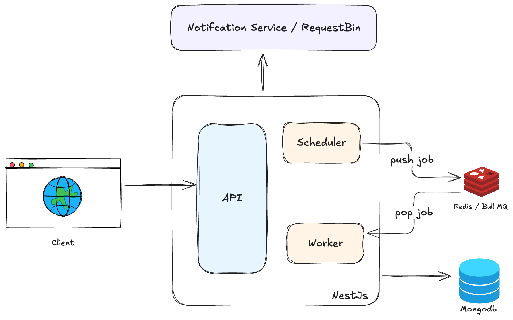
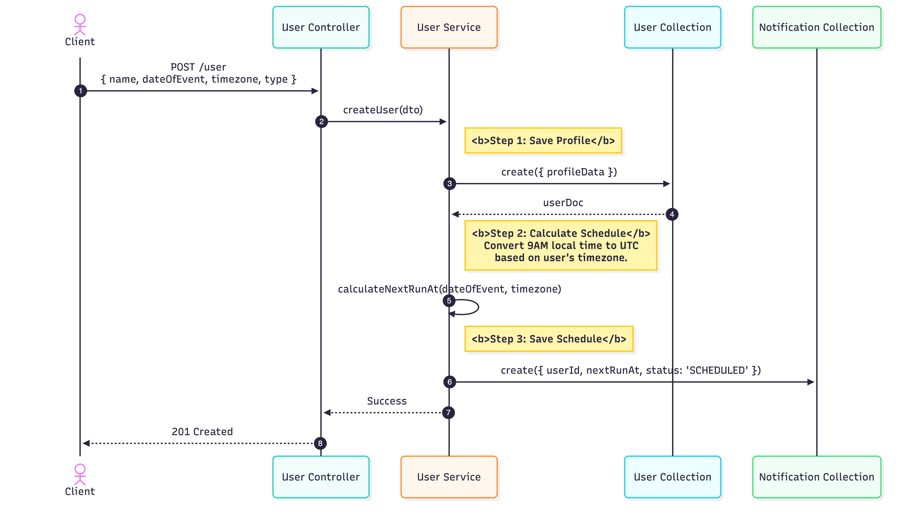
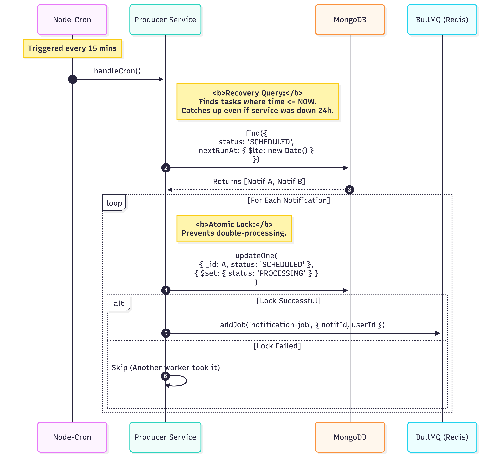
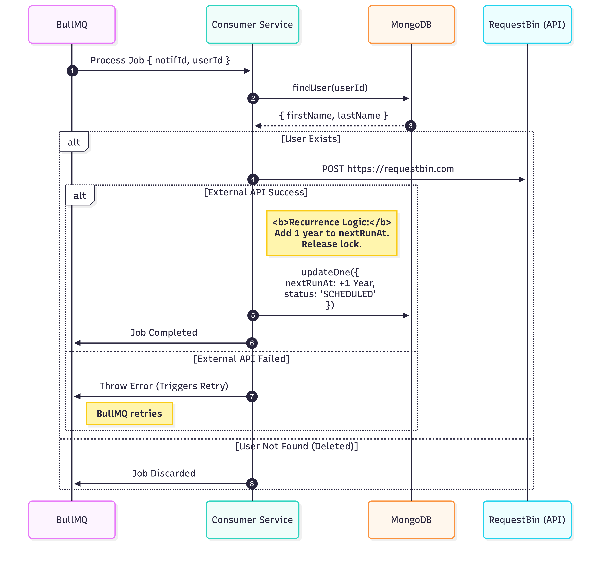

# Erin Living Assessment - Event Notification Scheduler

A scalable, event-driven birthday notification system built with NestJS, MongoDB, and Redis. This application automatically schedules and sends birthday notifications for users based on their timezone and date of birth.

## 🚀 Features

- **User Management**: Create, update, and delete user profiles with timezone support
- **Automatic Scheduling**: Birthday notifications scheduled based on user's local time
- **Queue-Based Processing**: Asynchronous job processing with BullMQ and Redis
- **Timezone Aware**: Handles different timezones correctly using Luxon
- **RESTful API**: Complete REST API with validation and error handling
- **Web Interface**: Simple HTML form for user creation
- **Comprehensive Testing**: 40+ unit tests with 70%+ coverage
- **Docker Ready**: Full containerization with Docker Compose
- **API Documentation**: Swagger/OpenAPI documentation

## 🏗️ Architecture

The system follows an event-driven producer-consumer architecture:


- **Scheduler (Producer)**: Runs every 15 minutes to find due notifications and queue jobs
- **Worker (Consumer)**: Processes queued jobs to send HTTP notifications
- **API**: REST endpoints for user and notification management
- **Database**: MongoDB for user profiles and notification schedules
- **Queue**: Redis/BullMQ for job queuing and processing

## � System Flows

### User Onboarding Flow


### Scheduler (Producer) Flow


### Worker (Consumer) Flow


*For more details and interactive diagrams, refer to the [Technical Design Document](docs/tech-design.md).*

## �🛠️ Tech Stack

| Component | Technology |
|-----------|------------|---------|
| Framework | NestJS |
| Language | TypeScript |
| Database | MongoDB |
| Queue | Redis/BullMQ |
| Date/Time | Luxon |
| Validation | class-validator |
| Logging | Pino |
| Testing | Jest |
| Container | Docker |

## 📋 Prerequisites

- Node.js 22+ and npm
- Docker and Docker Compose
- Git

## 🚀 Quick Start

### 1. Clone the Repository

```bash
git clone <repository-url>
cd erin-living-assessment
```

### 2. Install Dependencies

```bash
npm install
```

### 3. Start Infrastructure

```bash
# Start MongoDB and Redis
docker-compose up -d mongo redis
```

### 4. Configure Environment

Copy the environment template and adjust settings:

```bash
cp .env.example .env
# Edit .env with your database credentials and webhook URL
```

### 5. Run the Application

```bash
# Development mode
npm run start:dev

# Production build
npm run build
npm run start:prod
```

### 6. Access the Application

- **Web Interface**: http://localhost:3000
- **API Documentation**: http://localhost:3000/api
- **Health Check**: http://localhost:3000/health


## 🧪 Testing

```bash
# Run all tests
npm test

# Run with coverage
npm run test:cov

# Run e2e tests
npm run test:e2e
```

## 🐳 Docker Deployment

### Prerequisites

- Docker Engine 20.10+
- Docker Compose 2.0+
- At least 2GB free RAM
- Ports 3000, 27017, 6379, 6380 available

### Environment Setup

1. **Clone the repository**:
   ```bash
   git clone <repository-url>
   cd erin-living-assessment
   ```

2. **Configure environment variables**:
   ```bash
   cp .env.example .env
   # Edit .env with your settings
   ```

3. **Start infrastructure services**:
   ```bash
   # Start MongoDB and Redis
   docker-compose up -d mongo redis
   ```

### Development Deployment

```bash
# Start all services in development mode
npm run docker:dev

# Or manually:
docker-compose up

# View application logs
npm run docker:logs

# Stop services
npm run docker:down
```

### Database Schema

The application uses MongoDB with the following collections:
- `users`: User profiles with timezone information
- `notifications`: Scheduled notification jobs

## 📚 API Documentation

Complete API documentation is available via Swagger at `/api` when the application is running.

Key endpoints:
- `POST /user` - Create user
- `PUT /user/:id` - Update user
- `DELETE /user/:id` - Delete user
- `POST /scheduler/trigger` - Manually trigger scheduler
- `GET /health` - Health check

