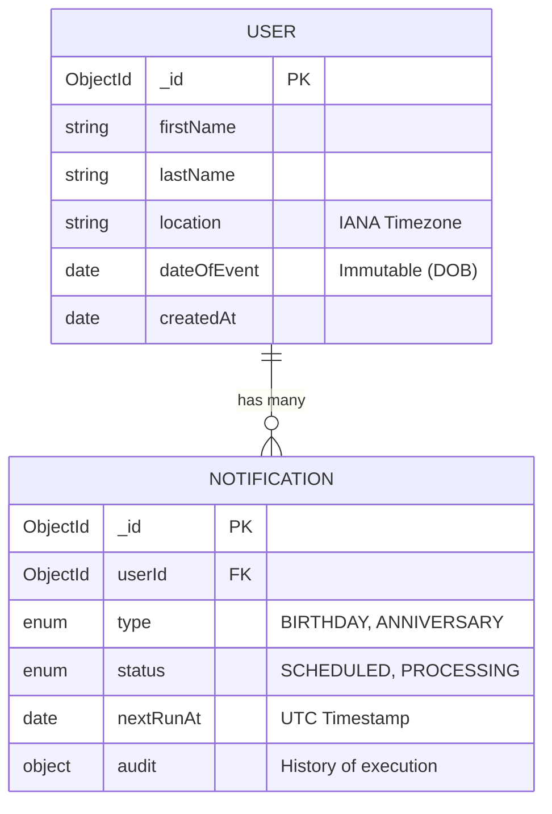
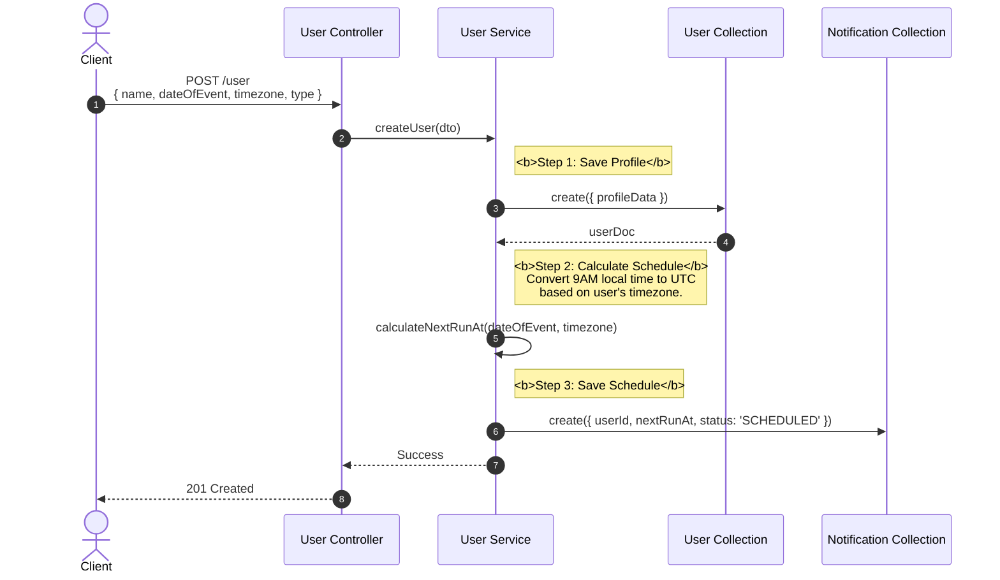
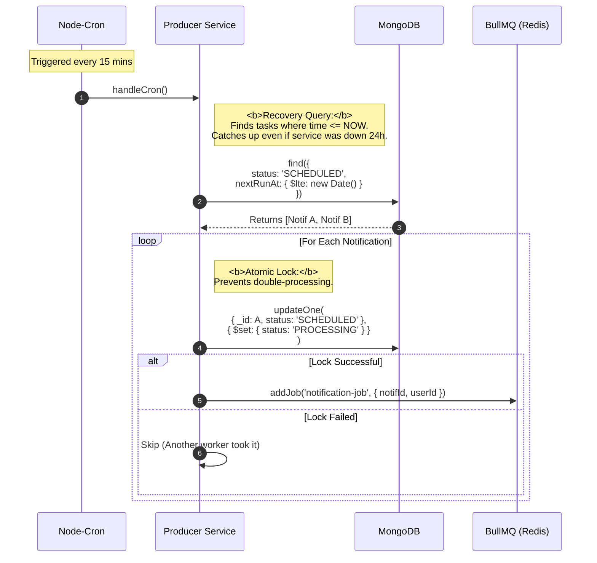
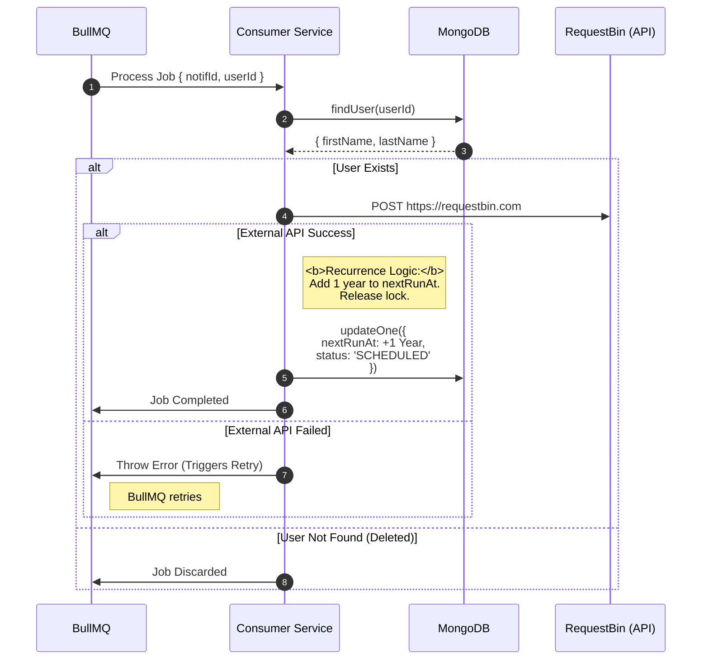

Here is the updated **`tech-design.md`** file with the **Tech Stack** section added.

---

# Technical Design Document

## 1. High-Level Architecture

The system follows a **Event-Driven, Producer-Consumer Architecture**. This decouples the "identification of work" (finding users to notify) from the "execution of work" (sending HTTP requests), ensuring high scalability and fault tolerance.


### Architectural Decisions

1. **Queue Decoupling (BullMQ):**
* Prevents database overload during "burst" times (e.g., if 10,000 users all have a 9:00 AM birthday).
* Provides automatic retries with exponential backoff for transient network failures.


2. **State Machine Pattern:**
* Uses explicit states (`SCHEDULED`, `PROCESSING`, `FAILED`) to manage concurrency.
* Prevents race conditions where multiple cron instances might try to process the same user.


3. **Data Normalization:**
* Separates `User` (Profile) from `Notification` (Schedule). This allows adding new event types (Anniversaries) without altering the User schema or logic.


---

## 2. Tech Stack & Libraries

We have chosen a stack that balances rapid development with "Enterprise-Grade" patterns.

| Category | Technology | Decision Rationale |
| --- | --- | --- |
| **Framework** | **NestJS** | Provides a modular, testable architecture (Dependency Injection) out of the box. Enforces clean code patterns compared to raw Express. |
| **Language** | **TypeScript** | Strict typing ensures the complex Date/Time logic is safe and refactor-friendly. |
| **Database** | **MongoDB (Mongoose)** | Flexible schema allows for easy evolution (adding "Anniversaries"). Excellent read performance for simple profile lookups. |
| **Messaging** | **BullMQ (Redis)** | Industry standard for Node.js queues. Handles delayed jobs, priorities, and retries natively. |
| **Scheduler** | **Node-Cron** | Lightweight process to trigger the "Producer" loop every 15 minutes. |
| **Timezones** | **Luxon** | Modern, immutable date library. chosen over Moment.js (deprecated) for better handling of IANA timezones and UTC conversions. |
| **Logging** | **NestJS-Pino** | JSON-based structural logging. Essential for debugging in Dockerized environments (allows log parsing tools to read context). |
| **Infrastructure** | **Docker Compose** | Orchestrates the App, Redis, and MongoDB with a single command (`docker-compose up`). |

---

## 3. Database Schema Design

We utilize MongoDB's flexibility while enforcing strict schemas via Mongoose to ensure data integrity.



---

## 4. Sequence Diagrams

### 4.1 User Onboarding (Creation Flow)

This flow handles the complexity of Timezone calculation *upfront*, so the scheduler doesn't have to perform heavy date math.



---

### 4.2 The Scheduler Loop (Producer)

This process runs every 15 minutes. It handles the "Recovery" requirement (catching up on missed tasks) and the "Concurrency" requirement (locking).



---

### 4.3 The Worker Pipeline (Consumer)

This component handles the external communication and the "Recurrence" logic (scheduling next year).



## 5. Implementation Clarifications

Based on project clarifications:

- **External API Integration**: Notifications are sent via HTTP POST to `https://webhook.site/32a777b8-de58-466c-86a9-fd82ef449ee7` with a JSON body `{message: "string"}`. The message format is "Hey, {firstName} {lastName} it's your {notificationType}".

- **Leap Year Handling**: For birthdays on February 29th, the next occurrence defaults to February 28th in non-leap years.

- **BullMQ Retry Configuration**: Maximum retries: 3. Retry interval: 5 seconds. Backoff strategy: Fixed time. After exhausting retries, the notification status is set to 'FAILED' and logged in the audit object.

- **Input Validation**: No additional validations are required for the MVP (e.g., no constraints on name lengths, date formats, or timezone restrictions beyond basic type checks).

- **Environment and Infrastructure**: Docker Compose will orchestrate Redis, MongoDB, and the application services. The RequestBin URL will be included as an environment variable or hardcoded in the worker for simplicity.

- **CORS Configuration**: The NestJS application will enable CORS globally to handle all cross-origin requests, ensuring the web interface and API can be accessed from different origins without issues.

## 6. API Documentation (Swagger/OpenAPI)

The application will use Swagger (via `@nestjs/swagger`) to generate interactive API documentation. The Swagger UI will be accessible at `/api` when the application is running.

### Endpoints

#### 1. Create User
- **Method**: POST
- **Path**: `/user`
- **Description**: Creates a new user profile and associated notification.
- **Request Body** (application/json):
  ```json
  {
    "firstName": "string",
    "lastName": "string",
    "dateOfEvent": "string" // YYYY-MM-DD
    "location": "string", // IANA Timezone
    "notificationType": "BIRTHDAY" // or "ANNIVERSARY"
  }
  ```
- **Responses**:
  - `201 Created`: User created successfully. Returns the user object with `_id`, `firstName`, `lastName`, `location`, `dateOfEvent`, `createdAt`, `updatedAt`.
  - `400 Bad Request`: Invalid input data.
  - `500 Internal Server Error`: Server error.

#### 2. Update User
- **Method**: PUT
- **Path**: `/user/{id}`
- **Description**: Updates an existing user profile. Only `firstName`, `lastName`, and `location` can be updated. If `location` changes, `nextRunAt` is recalculated.
- **Path Parameters**:
  - `id` (string): User ID.
- **Request Body** (application/json):
  ```json
  {
    "firstName": "string" // optional
    "lastName": "string", // optional
    "location": "string" // optional, IANA Timezone
  }
  ```
- **Responses**:
  - `200 OK`: User updated successfully. Returns the updated user object.
  - `404 Not Found`: User not found.
  - `400 Bad Request`: Invalid input data.
  - `500 Internal Server Error`: Server error.

#### 3. Delete User
- **Method**: DELETE
- **Path**: `/user/{id}`
- **Description**: Deletes a user profile and cascades to delete associated notifications.
- **Path Parameters**:
  - `id` (string): User ID.
- **Responses**:
  - `204 No Content`: User deleted successfully.
  - `404 Not Found`: User not found.
  - `500 Internal Server Error`: Server error.

#### 4. Health Check
- **Method**: GET
- **Path**: `/health`
- **Description**: Checks connectivity to MongoDB and Redis databases.
- **Responses**:
  - `200 OK`: Both MongoDB and Redis are available. Response body: `{ "status": "success" }`
  - `503 Service Unavailable`: One or both databases are down. Response body: `{ "status": "not available" }`

### Swagger Configuration
- The Swagger module will be configured in `app.module.ts` with title "Scheduler Service API", version "1.0", and description based on the project overview.
- All DTOs (Data Transfer Objects) will be decorated with Swagger annotations for automatic schema generation.

### Web Interface
- A simple HTML page will be served at the root path `/` with a form to input user creation fields (`firstName`, `lastName`, `dateOfEvent`, `location`, `notificationType`).
- The `notificationType` field will be a dropdown with options "BIRTHDAY" (default) and "ANNIVERSARY".
- The form will submit a POST request to `/user` and display the response (success or error).
- This provides a basic UI for testing the create user functionality without needing external API tools.
